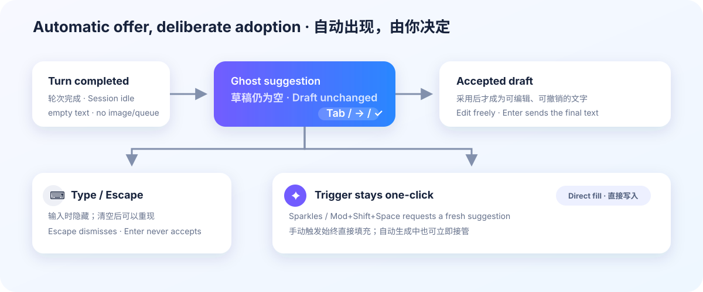

# Prompt for Me（Prompt 嘴替）

[English](README.md)

[](https://www.npmjs.com/package/dsh-prompt-for-me) [](https://www.npmjs.com/package/dsh-prompt-for-me) [](https://github.com/ChuanTianML/prompt-for-me)

Prompt for Me 会根据 DeepSeek Harness 中有界的会话历史和本地建议交互，推测你下一句可能想说什么。每当 Agent 完成一轮，它会安静地展示一条 ghost text；在你采用前，草稿仍然为空，插件也绝不会代替你发送。



## 功能

- 只有在出现新的已完成轮次、Session 空闲、plan mode 未生效，并且输入框文字严格为空、没有图片和排队意图时，才会自动生成。
- Host 策略尚未载入或输入框暂时不符合条件时，会保留这条已完成轮次；条件恢复后再生成一次。
- 更新的轮次完成时会淘汰上一段上下文留下的建议；即使提交过快、没有渲染中间输入状态，也不会让旧建议阻塞新建议。
- 新版 Harness 使用输入框内联 ghost text；较旧客户端使用一张不修改草稿的轻量预览卡片。
- 按 Tab、右方向键或相邻勾选控件采用 ghost；Enter 永远不会采用 ghost。
- 开始输入会隐藏 ghost，清空文字后可以再次显示，Escape 会关闭它。
- 保留 Sparkles Trigger 和 `Mod+Shift+Space` 快捷键。显式 Trigger 总会请求一条新建议并直接写入草稿，即使后台自动生成尚未结束。
- 下一次显式请求会携带本轮已经跳过的建议，要求模型不得重复或改写复述；该列表最多保留 10 条。
- 不绕过 Harness 权限审批、不调用工具、不自动发送消息。

## 交互对照

| 场景 | 结果 |
| --- | --- |
| 一轮完成且输入框符合条件 | 自动建议显示在草稿之外。 |
| Tab、右方向键或勾选控件 | 可见建议成为一次可撤销的草稿编辑。 |
| 只有 ghost 时按 Enter | 不采用，也不发送。 |
| 开始输入 | ghost 隐藏，以用户文字为准。 |
| 清空刚输入的文字 | 无须再次调用模型，隐藏建议可以重新显示。 |
| Escape | 关闭可见建议。 |
| Sparkles 按钮或 `Mod+Shift+Space` | 重新生成，并直接填充或替换草稿。 |
| 编辑后按 Enter | 只发送最终文本；此时才把采用结果计入正向反馈。 |

## 安装

推荐安装 Release 中已经构建好的 tarball，不需要执行构建脚本：

```sh
dsh plugin --profile web add https://github.com/ChuanTianML/prompt-for-me/releases/download/v0.6.0/dsh-prompt-for-me-0.6.0.tgz
```

安装后重启 `dsh web`。

也可以安装固定 Git 标签：

```sh
dsh plugin --profile web add github:ChuanTianML/prompt-for-me#v0.6.0
```

使用 pnpm 10 从 Git 安装时，可能需要在 Web profile 的 `pnpm-workspace.yaml` 中为 `allowBuilds` 添加 `dsh-prompt-for-me: true`，然后重新运行命令。`prepare` 脚本只复制 checkout 中的 Host 文件并包装 Client factory，不会下载任何内容。

更新或卸载：

```sh
dsh plugin --profile web update dsh-prompt-for-me
dsh plugin --profile web remove dsh-prompt-for-me
```

当前 DeepSeek Harness 开发版本提供原生内联建议 API。如果该 API 不存在、但客户端仍提供已完成轮次投影，插件会退化为带“采用”和关闭控件的明确预览卡片。无论使用哪种展示形式，手动 Sparkles 流程都保持直接写入。

## Web UI 设置

打开 **设置 → 插件 → 可配置**，展开 **Prompt for Me / Prompt 嘴替**。设置卡片沿用 Harness 的设置层级、颜色、间距和保存交互，并把选择持久化到统一的 Host 用户设置中；保存后立即生效，无须重启。

- **Agent 回复后自动建议**：默认开启。关闭后会撤下尚未采用的自动 Ghost Text，并停止后续自动生成；Sparkles 手动 Trigger 仍然可用。
- **手动生成快捷键**：默认是 `Mod+Shift+Space`。点击当前组合键后直接按下新的 Command/Ctrl 或 Alt 组合键，也可以单独关闭快捷键。Ghost Text 的采用键仍由 Harness 管理，默认是 Tab。
- **高级设置 → 建议模型**：默认跟随当前 Session 已选择的模型；也可以固定到当前 Harness 模型目录中的某个 provider/model。

界面不提供“参考范围”“快速/个性化模式”“重置个性化记录”或内部 token/超时参数。这些行为由插件统一选择，以免把上下文质量和个性化策略的复杂性转嫁给用户。

## 模型和 API Key

插件在 Harness Host 上调用 `ctx.llm`。默认优先复用当前会话的 provider/model，没有时使用 Harness 默认模型，因此使用的就是 DeepSeek Harness 已配置的 API Key。浏览器拿不到也不会读取这个 Key，插件没有单独的 Key。

普通用户可在 Web UI 的高级设置中固定辅助模型。部署维护者也可在 `cordis.patch.yml` 或更高优先级的 profile patch 中同时配置一个基础值；用户保存的 Web UI 设置优先于这个基础值：

```yaml
- id: prompt-for-me
  name: dsh-prompt-for-me
  config:
    provider: deepseek-official
    model: deepseek-chat
```

## 数据与隐私

每次自动或显式生成建议时，Host 可能把下列有界文本发送给当前选择的模型提供方：

- 当前草稿；
- 当前会话最近 3 轮真人用户/助手文本；
- 当前会话中已发送的建议编辑、原样接受和拒绝记录；
- 来自最多 20 个历史会话的手写提示词和建议交互原始样本；
- 本轮最多 10 条已经跳过的建议，用于让模型避免重复或改写复述。

当前草稿和最近 3 轮决定当前任务、意图和消息内容；当前会话反馈只调整眼前的表达；跨会话记忆只能影响长期的风格、详略和工作流偏好。手写提示词和编辑后发送的建议权重高于原样接受，拒绝记录只作为较弱的负向信号。编辑建议后再次 Trigger 会拒绝原建议，但不会把尚未发送的编辑结果当成正向偏好。

Harness 会把工作区指令、运行时上下文和 Skill 列表记录为用户角色事件；插件会从会话轮次和偏好记忆中排除这些非真人来源。如果草稿与真人会话均为空，插件会在调用模型前停止生成。

常见 API Key、token、password 和 Bearer token 会在模型调用前替换为 `[REDACTED_SECRET]`。插件不会收集附件、工具参数、文件、凭证或二进制内容；没有分析上报服务，只会调用 Harness 已选择的模型路由。

交互记录只保存在当前浏览器 `localStorage` 的 `dsh.prompt-for-me.outcomes.v2`，每条包含会话 ID、最终动作、来源以及相关的原文/最终文本。仅仅看到或采用 ghost 不算正向反馈，实际发送后才会形成证据。V1 记录会自动迁移，原记录不会删除。插件不提供要求用户管理这些记录的重置入口。

DeepSeek Harness `0.1.0-rc.6` 尚未提供下游插件注册自定义持久化 session event 的公开接口。因此独立版不会把辅助模型请求和建议结果追加到 Harness session log；强行写入会导致原版运行时无法重新读取会话。这是独立版与实验性仓库内实现的主要差异，待官方开放事件注册接口后再补齐。

生成 RPC 使用 NDJSON。每条候选只有在完整并通过校验后才会进入临时建议界面或草稿；模型的半截 token 和不完整 JSON 不会进入输入框。后台失败保持安静，显式触发失败会显示在 Sparkles 控件上。

辅助请求始终使用 `off` reasoning。模型收到一段系统指令，以及一条包含 `current`、`currentSessionFeedback`、`userPreferenceMemory` 和 `currentCycleSkipped` 的 JSON 用户消息；不会收到工具定义或附件。

Host 在内存中保留最近 50 条隐私安全的性能记录，并把每条记录以 `prompt-for-me metrics` 写入日志。记录包含模型路由、各类文本的字节数/条数、历史读取和输入组装耗时、首个模型增量/reasoning/text 的时间、建议到达时间、模型与请求总耗时，以及提供方返回的 token usage；不包含提示词、候选或交互结果正文。可查询当前进程：

```sh
curl -sS -X POST -H 'content-type: application/json' \
  -d '{"method":"metrics"}' \
  http://127.0.0.1:3080/dsh-prompt-for-me/rpc
```

## 配置

Web UI 只公开上述三个对日常交互有明确价值的选项。下表是面向部署维护者的 `cordis.patch.yml` 组合参数；生成限制保留稳定默认值，不要求普通用户调整：

| 字段 | 默认值 | 含义 |
| --- | ---: | --- |
| `automatic` | `true` | 在符合条件的已完成轮次后展示一条不进入草稿的建议。 |
| `maxCandidateBytes` | `4096` | 单条建议 UTF-8 上限。 |
| `maxDraftBytes` | `32768` | 草稿或编辑结果 UTF-8 上限。 |
| `maxCurrentCycleSkipped` | `10` | 作为下一次 Trigger 强负向上下文保留的已跳过建议数。 |
| `maxCurrentCycleSkippedBytes` | `16384` | 当前周期已跳过建议共享的 JSON 预算。 |
| `maxCurrentTurns` | `3` | 保留的当前会话最近轮数。 |
| `maxCurrentContextBytes` | `16384` | 最近会话轮次的 JSON 预算。 |
| `maxCurrentFeedbackBytes` | `4096` | 当前会话建议反馈的 JSON 预算。 |
| `maxPreferenceMemoryBytes` | `8192` | 跨会话偏好记忆的 JSON 预算。 |
| `maxHistorySessions` | `20` | 检查的历史会话数。 |
| `maxManualPrompts` | `8` | 保留的历史手写提示词数。 |
| `maxEditedSuggestions` | `6` | 每个反馈层保留的建议编辑对数。 |
| `maxAcceptedExact` | `6` | 每个反馈层保留的原样接受数。 |
| `maxRejectedSuggestions` | `4` | 每个反馈层保留的弱拒绝信号数。 |
| `maxLocalOutcomes` | `50` | 浏览器本地交互记录上限。 |
| `maxLocalOutcomesBytes` | `131072` | 浏览器本地记录及其 RPC 副本共享的 JSON 预算。 |
| `maxOutputTokens` | `2048` | 辅助模型输出预算。 |
| `timeoutMs` | `30000` | 辅助模型调用超时。 |
| `shortcut` | `Mod+Shift+Space` | 跨平台 Trigger，也可设为 `disabled`。 |

## 开发

需要 Node.js 22.19 或更高版本。

```sh
npm run check
```

该命令会重新构建 Host/Client 静态产物、运行 Node 测试，并检查 npm 包内容。

## License

MIT
